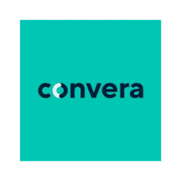

# week1-homework
# Convera Case Study

## Overview and Origin
[Convera website](https://www.convera.com)

* What is the name of the company?
**Convera (formerly known as Western Union Business Solutions) is one of the world’s largest non-bank FinTechs in global B2B payments, with capabilities in over 140 currencies across more than 200 countries and territories and 60 global banking partners.**

* When was the company incorporated? 
**December 21, 2000**

* Who are the founders of the company? 
**Patrick Gauthier**

* How did the idea for the company come about? 
**Until 2007, Convera's primary focus was the enterprise search market through its flagship product, RetrievalWare, which is widely used within the secure government sector in the United States, UK, Canada and a number of other countries. Convera sold its enterprise search business to FAST Search & Transfer in August 2007 for $23 million, at which point RetrievalWare was officially retired.**

* How is the company funded? How much funding have they received?
**Convera Corporation is funded by 6 investors. Entrepia Ventures and Wesley Clover are the most recent investors. A controlling interest in Convera was held by Allen & Company, a New York based investment bank. Allen & Company has been associated with Convera since its foundation in 2000 and was also a major shareholder in Excalibur Technologies for many years. Legg Mason Opportunity Trust also had a sizable holding. Donald McCauley and John Yauch maintained a large but minority share of the company. They were two of the most vocal backers, often referring to the company as a "coiled spring."**

## Business Activities

* What specific financial problem is the company or project trying to solve?
**Convera gives over 30,000 customers worldwide a better way to move money — helping them navigate the complexity of global commerce and capture more value with every transaction.**

* Who is the company's intended customer?  Is there any information about the market size of this set of customers?

* What solution does this company offer that their competitors do not or cannot offer? (What is the unfair advantage they utilize?)

* Which technologies are they currently using, and how are they implementing them? (This may take a little bit of sleuthing–– you may want to search the company’s engineering blog or use sites like StackShare to find this information.)

## Landscape

* What domain of the financial industry is the company in? Financial and FX Payments Transactions.

* What have been the major trends and innovations of this domain over the last 5–10 years? Cross Border Payments

* What are the other major companies in this domain? 
****BookMyForex, Travelex, Travel Wallet, WSFx Global Pay and 4xLabs. Convera has 38 active competitors.**

## Results

* What has been the business impact of this company so far?
**Convera Corporation provided software as a service (SaaS) vertical search services to publishers and other media companies. Publishers used the web search platform to create customized search experiences for specialist audiences. Convera's vertical search service was used by many of the leading publishing companies, including John Wiley & Sons., Centaur Media, Incisive Media, Lebhar-Friedman and Advanstar. Vertical search applications were usually presented under the publisher's brand and typically combined a mixture of public web data (selected by the publisher as being the best public content available on the subject), the publisher's proprietary content and private content provided by third parties.**

* What are some of the core metrics that companies in this domain use to measure success? How is your company performing, based on these metrics? 

**Please see the Company Blog Readout of 2022-Record-Revenue for growth.**

* How is your company performing relative to competitors in the same domain?
** In 2009 Convera ran in the middle of the pack from its competitors right with an Net Income of 23 Millon USD. 2022 was a record year for Convera with double-digit growth and over $500MM in gross revenue

## Recommendations

* If you were to advise the company, what products or services would you suggest they offer? **Convera is a leader in the Global Payments services, they also are a leader in MassPayment transactions.**

* Why do you think that offering this product or service would benefit the company?

* What technologies would this additional product or service utilize?
**Convera is a leader in regulatory enterprise architecture solutions that in the future will provide cutting edge financial security for the blockchain. Solutions within Temenos, and Amazon Web Services will offer the latest services that focus on strong AI and Machine Learning capabilities**

* Why are these technologies appropriate for your solution?
**Increases not just the speed and accuracy of transactions is important, but the security of party data and how the money is moved, and files within transactions are verified is a wonder solution to deliver strategy that will help build client trust.**